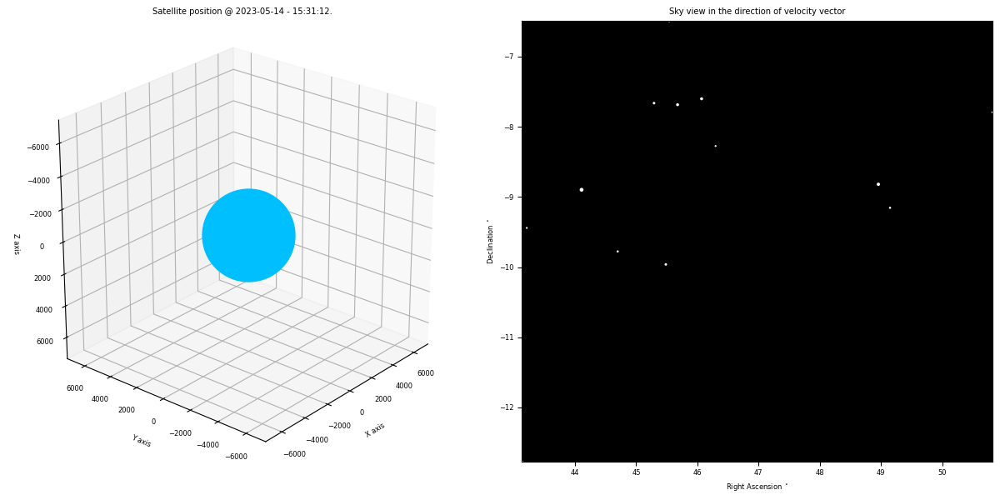
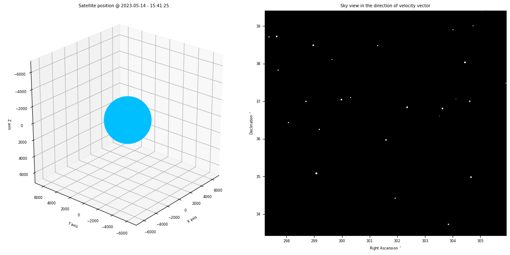

# Starfield view from satellite in orbit
> Animated plot of the starfield as viewed in the velocity direction of a satelitte using TLE propagated data.   

## Table of contents
* [General info](#general-info)
* [Screenshots](#screenshots)
* [Setup](#setup)
* [How to run ](#how)
* [Updates](#updates)
* [To-do list](#to-do)

## Screenshots
Animated plot generated by the script.    

1.  OBJECT A    
 

1.  RISAT-2B     
 

&nbsp;         

## General info
As the satellite moves around the orbit, the sky view rendered as seen by a camera positioned in the direction of velocity vector.  
TLE (Two-Line Elements) is used for calculating positions around orbit. For any given valid satellite in space, TLE's can be acquired from [Celestrak](https://celestrak.org/NORAD/documentation/gp-data-formats.php) using its NORAD id.   
&nbsp;   
Example : https://celestrak.org/NORAD/elements/gp.php?FORMAT=TLE&CATNR=44233   
&nbsp;   
Hipparcos Catalogue is used for star details and the fields extracted are      
Field H5: V magnitude    
Fields H8–9:  The right ascension, α , and declination, δ (in degrees)  

## Method   
1.  Satellite position is calculated from TLE propagation using [sgp4](https://pypi.org/project/sgp4/) library. 
2.  Right Ascension(RA) and declination(DEC) are derived from the velocity vector.   
3.  Retrieve those star details that falls within a threshold magnitude and a field of view defined by the camera.
4.  Plot and animate the starfield view as seen by the satellite.   

   
&nbsp;    

## Setup
Script is written with python (Version: 3.10.6) on linux. Additional modules required :   

* numpy       (tested with Version: 1.21.5 )
* matplotlib  (tested with Version: 3.5.1 )
* pandas      (tested with Version: 1.3.5 )
* sgp4        (tested with Version: 2.21 )

## How to run   
* Verify and install required modules 
* run `python view_orbit.py`. 

## Updates   
*   
*   *  

## To-do list
* 

